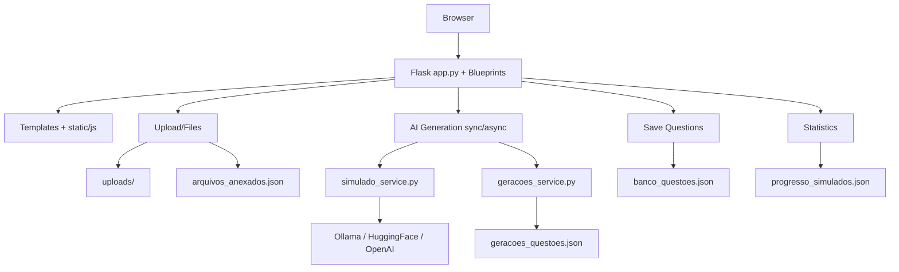
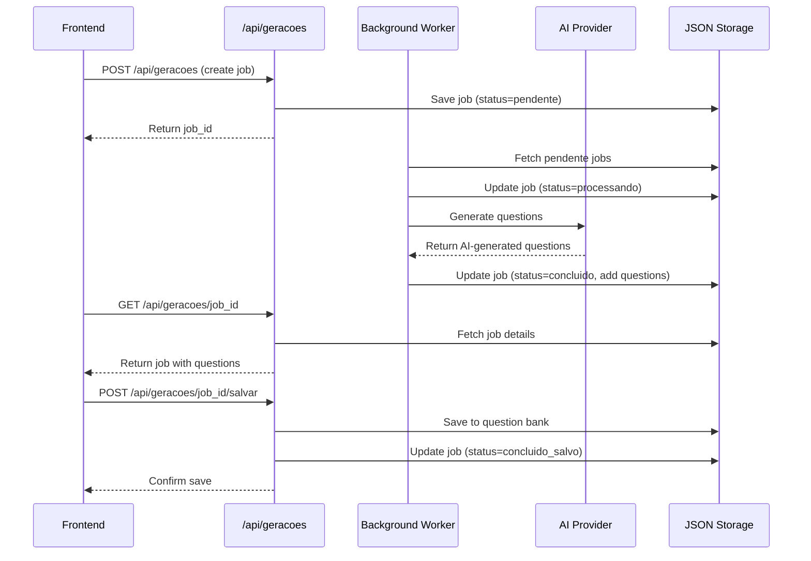

# System Architecture — ISTQB CTAL-TA

## 1) Overview

The project is a monolithic Flask web application with server-rendered frontend (templates + JavaScript), JSON file-based persistence, and support for question generation via AI in both synchronous and asynchronous modes (jobs).

Key characteristics:
- Web interface for simulations, flashcards, dashboard, file management, and generation tracking
- Material upload (PDF/TXT) with text extraction
- Question generation from multiple LLM providers
- Optional asynchronous pipeline with background worker thread
- Screenshot gallery publication via GitHub Pages

---

## 2) Stack and Dependencies

Dependencies declared in `requirements.txt`:
- Flask `3.0.0`
- PyPDF2 `3.0.1`
- Werkzeug `3.0.1`
- requests `2.32.3` (LLM API integrations)

Note: `requests` is used in `app/services/simulado_service.py` for API communication and must be available in the runtime environment.

---

## 3) Component Organization

### Backend (HTTP layer + orchestration)
- `app.py`
  - Flask initialization and environment-based configuration
  - Main page and API routes
  - File upload, text extraction, simulation flow, flashcard handling, and materials management
  - Optional asynchronous worker initialization

- `app/routes/`
  - `geracoes.py`: Blueprint focused on `/api/geracoes*` endpoints
  - `__init__.py`: Explicit blueprint registration

### Services (domain logic layer)
- `app/services/simulado_service.py`
  - LLM integrations (Ollama/HuggingFace/OpenAI)
  - Question payload normalization and validation
  - Parsing helpers and fallback mechanisms

- `app/services/geracoes_service.py`
  - CRUD operations for async jobs persisted in JSON (`geracoes_questoes.json`)

- `app/services/flashcards_service.py`
  - Placeholder (operational logic currently in `app.py`)

### Frontend
- Jinja2 templates in `templates/`
- JavaScript in `static/js/` organized by feature (`simulado.js`, `flashcards.js`, `arquivos.js`, `geracoes.js`, etc.)
- Global CSS in `static/css/style.css`

### Persistence (file-based)
- `arquivos_anexados.json`: Metadata of uploaded files
- `geracoes_questoes.json`: State of asynchronous generation jobs
- `banco_questoes.json`: Database of generated and validated questions
- `progresso_simulados.json`: Simulation progress tracking

---

## 4) Primary Architectural Flows

### 4.1 Simulation Flow
1. Frontend calls `POST /api/iniciar-simulado`
2. Backend selects questions from `QUESTOES_DB` and saves state in session
3. Frontend sends answers to `POST /api/finalizar-simulado`
4. Backend calculates result, persists tracking, returns detailed feedback

### 4.2 File Upload and Synchronous Generation Flow
1. Upload via `POST /api/upload` (extension + MIME validation)
2. Metadata persisted in `arquivos_anexados.json`
3. Direct generation via `POST /api/gerar-questoes/<arquivo_id>`
4. Questions returned for frontend review
5. Saving via `POST /api/arquivos/salvar-questoes/<arquivo_id>` to `banco_questoes.json`

### 4.3 Asynchronous Generation (Jobs) Flow
1. Frontend creates job with `POST /api/geracoes`
2. Job enters as `pendente` in `geracoes_questoes.json`
3. Worker (thread) processes pending jobs when `ENABLE_GERACOES_WORKER=1`
4. Status evolves: `pendente` → `processando` → `concluido`/`erro` → `concluido_salvo`
5. Frontend monitors via `GET /api/geracoes` and `GET /api/geracoes/<job_id>`
6. Final saving via `POST /api/geracoes/<job_id>/salvar`

### 4.4 Study Materials Flow
1. `GET /api/materiais` lists allowed files from `uploads/` folder
2. `GET /api/materiais/arquivo/<filename>` serves file with extension allowlist
3. Frontend displays unified library (annexed + uploaded materials)

---

## 5) Security and Reliability

Implemented controls:
- Extension and MIME type validation for PDF/TXT uploads
- `secure_filename` for file naming
- Payload size limit via `MAX_CONTENT_LENGTH`
- Session cookies configured with `HTTPOnly`, `SameSite`, and `Secure` flags
- Fail-fast `SECRET_KEY` validation in production environment
- Basic path traversal protection in `/api/materiais/arquivo/<filename>`

Considerations:
- JSON file persistence lacks robust locking for high concurrency
- Thread-based worker doesn't scale like a dedicated message queue
- `requests` dependency must be declared in `requirements.txt`

---

## 6) Configuration and Execution

Relevant environment variables:
- `SECRET_KEY`
- `UPLOAD_FOLDER` (default: `uploads`)
- `MAX_CONTENT_LENGTH`
- `GERACOES_FILE` (default: `geracoes_questoes.json`)
- `ARQUIVOS_FILE` (default: `arquivos_anexados.json`)
- `ENABLE_GERACOES_WORKER` (set to `1` to enable background worker)
- `FLASK_DEBUG`, `PORT`, `LOG_LEVEL`

Standard execution:
- Web app: `python app.py`
- Worker: enabled in same process via `ENABLE_GERACOES_WORKER=1`

---

## 7) Screenshot Gallery Publication

The screenshot gallery is published via GitHub Pages through the workflow:
- `.github/workflows/pages.yml`

Published artifacts:
- `screenshots.html`
- `prints/`
- Redirect `index.html` to gallery

---

## 8) Recommended Technical Roadmap

1. Extract routes from `app.py` into domain-based blueprints (`simulado`, `arquivos`, `flashcards`, `materiais`).
2. Migrate JSON persistence to database (SQLite/PostgreSQL) with repository layer.
3. Replace thread-based worker with dedicated message queue (RQ/Celery) for robustness and scalability.
4. Centralize payload validation with schemas (pydantic/marshmallow).
5. Implement comprehensive test coverage (services + critical APIs).

---

## 9) System Architecture Diagram

This document describes the current state of the architecture based on the versioned codebase.

---

## 10) Async Generation Architecture Detail

---

This document represents the system architecture as of the current codebase version.
