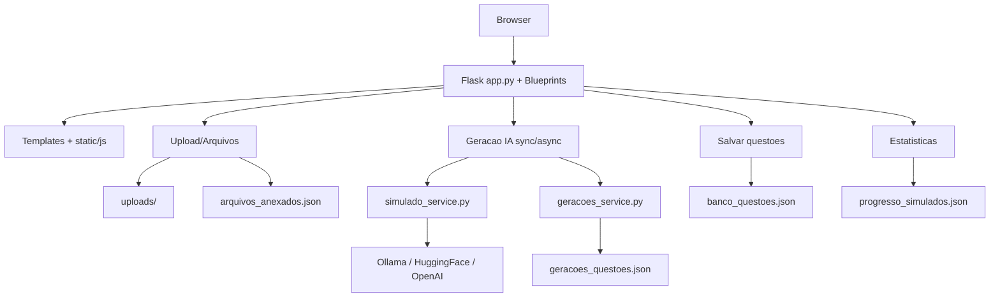

# Arquitetura do Sistema — ISTQB CTAL-TA

## 1) Visão geral

O projeto é uma aplicação web monolítica em Flask com frontend server-rendered (templates + JavaScript), persistência em arquivos JSON e suporte a geração de questões com IA em modo síncrono e assíncrono (jobs).

Características principais:
- Interface web para simulados, flashcards, dashboard, arquivos e gerações
- Upload de materiais (PDF/TXT) e extração de texto
- Geração de questões por múltiplos providers de LLM
- Pipeline assíncrono com worker em thread (opcional)
- Publicação de galeria de prints via GitHub Pages

---

## 2) Stack e dependências

Dependências declaradas em `requirements.txt`:
- Flask `3.0.0`
- PyPDF2 `3.0.1`
- Werkzeug `3.0.1`

Dependências usadas no código (já importadas):
- `requests` (integração com APIs de LLM)

Observação: `requests` é utilizado em `app/services/simulado_service.py` e deve estar presente no ambiente de execução.

---

## 3) Organização de componentes

### Backend (camada HTTP + orquestração)
- `app.py`
  - Inicialização do Flask e configurações por variáveis de ambiente
  - Rotas de páginas e APIs principais
  - Upload, extração de texto, fluxo de simulados, flashcards e materiais
  - Inicialização opcional de worker assíncrono

- `app/routes/`
  - `geracoes.py`: blueprint focado em `/api/geracoes*`
  - `__init__.py`: registro explícito dos blueprints ativos

### Serviços (camada de domínio/lógica)
- `app/services/simulado_service.py`
  - Integrações com LLM (Ollama/HuggingFace/OpenAI)
  - Normalização e validação de payloads de questões
  - Helpers de parsing e fallback

- `app/services/geracoes_service.py`
  - CRUD de jobs assíncronos em JSON (`geracoes_questoes.json`)

- `app/services/flashcards_service.py`
  - Placeholder (a lógica operacional está atualmente no `app.py`)

### Frontend
- Templates Jinja em `templates/`
- JS em `static/js/` por feature (`simulado.js`, `flashcards.js`, `arquivos.js`, `geracoes.js`, etc.)
- CSS global em `static/css/style.css`

### Persistência (file-based)
- `arquivos_anexados.json`: metadados de uploads
- `geracoes_questoes.json`: estado de jobs assíncronos
- `banco_questoes.json`: banco de questões geradas/validadas
- `progresso_simulados.json`: tracking de simulados

---

## 4) Fluxos arquiteturais principais

### 4.1 Fluxo de simulados
1. Frontend chama `POST /api/iniciar-simulado`
2. Backend seleciona questões de `QUESTOES_DB` e salva estado em sessão
3. Frontend envia respostas para `POST /api/finalizar-simulado`
4. Backend calcula resultado, persiste tracking e retorna feedback detalhado

### 4.2 Fluxo de arquivos e geração síncrona
1. Upload via `POST /api/upload` (validação de extensão + MIME)
2. Metadados persistidos em `arquivos_anexados.json`
3. Geração direta via `POST /api/gerar-questoes/<arquivo_id>`
4. Questões retornam para revisão no frontend
5. Salvamento via `POST /api/arquivos/salvar-questoes/<arquivo_id>` em `banco_questoes.json`

### 4.3 Fluxo de gerações assíncronas (jobs)
1. Frontend cria job com `POST /api/geracoes`
2. Job entra como `pendente` em `geracoes_questoes.json`
3. Worker (thread) processa pendências quando `ENABLE_GERACOES_WORKER=1`
4. Status evolui para `processando`, `concluido`, `erro` ou `concluido_salvo`
5. Frontend acompanha por `GET /api/geracoes` e `GET /api/geracoes/<job_id>`
6. Salvamento final por `POST /api/geracoes/<job_id>/salvar`

### 4.4 Fluxo de materiais de estudo
1. `GET /api/materiais` lista arquivos permitidos da pasta `uploads/`
2. `GET /api/materiais/arquivo/<filename>` serve o arquivo com allowlist de extensões
3. Frontend exibe biblioteca unificada (anexos + uploads)

---

## 5) Segurança e confiabilidade

Controles implementados:
- Validação de extensão e MIME para upload de PDF/TXT
- `secure_filename` para nomes de arquivo
- Limite de payload com `MAX_CONTENT_LENGTH`
- Cookie de sessão com `HTTPOnly`, `SameSite` e `Secure` configuráveis
- Fail-fast de `SECRET_KEY` em ambiente de produção
- Proteção básica contra path traversal em `/api/materiais/arquivo/<filename>`

Pontos de atenção:
- Persistência local em JSON não possui locking robusto para alta concorrência
- Worker em thread no processo web não escala como fila dedicada
- Dependência `requests` deve ser garantida em `requirements.txt`

---

## 6) Configuração e execução

Variáveis de ambiente relevantes:
- `SECRET_KEY`
- `UPLOAD_FOLDER` (default: `uploads`)
- `MAX_CONTENT_LENGTH`
- `GERACOES_FILE` (default: `geracoes_questoes.json`)
- `ARQUIVOS_FILE` (default: `arquivos_anexados.json`)
- `ENABLE_GERACOES_WORKER` (`1` para habilitar worker)
- `FLASK_DEBUG`, `PORT`, `LOG_LEVEL`

Execução padrão:
- App web: `python app.py`
- Worker: habilitado no mesmo processo via `ENABLE_GERACOES_WORKER=1`

---

## 7) Publicação de galeria (prints)

A galeria de imagens é publicada por GitHub Pages via workflow:
- `.github/workflows/pages.yml`

Artefatos publicados:
- `screenshots.html`
- `prints/`
- `index.html` de redirecionamento para a galeria

---

## 8) Roadmap técnico recomendado

1. Extrair rotas de `app.py` para blueprints por domínio (`simulado`, `arquivos`, `flashcards`, `materiais`).
2. Migrar persistência de JSON para banco (SQLite/PostgreSQL) com camada de repositório.
3. Substituir worker em thread por fila real (RQ/Celery) para robustez e escalabilidade.
4. Centralizar validações de payload com schemas (pydantic/marshmallow).
5. Cobertura de testes automatizados (serviços + APIs críticas).

---

## 9) Diagrama lógico (alto nível)

Este documento descreve o estado atual da arquitetura com base no código versionado.
